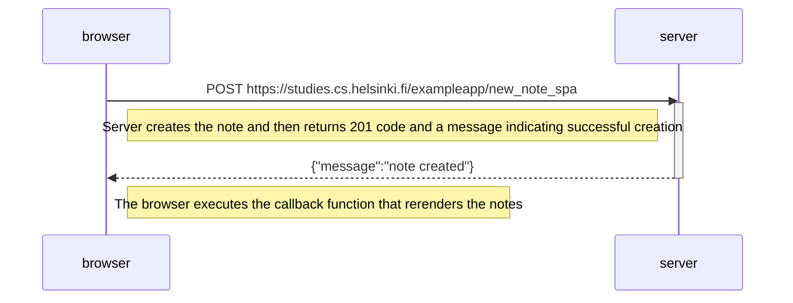

```mermaid
sequenceDiagram
    participant browser
    participant server

    browser->>server: POST https://studies.cs.helsinki.fi/exampleapp/new_note_spa
    activate server
    Note left of server: Server creates the note and then returns 201 code and a message indicating successful creation
    server-->>browser: {"message":"note created"}
    deactivate server


    Note right of browser: The browser executes the callback function that rerenders the notes
```