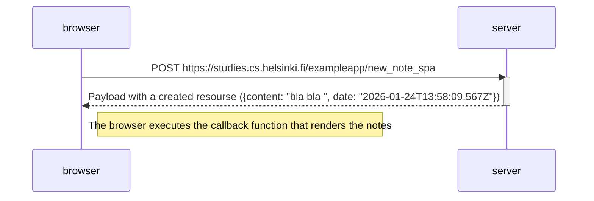

```mermaid
sequenceDiagram
    participant browser
    participant server

    browser->>server: POST https://studies.cs.helsinki.fi/exampleapp/new_note_spa
    activate server
    server-->>browser: Payload with a created resourse ({content: "bla bla ", date: "2026-01-24T13:58:09.567Z"})
    deactivate server


    Note right of browser: The browser executes the callback function that renders the notes
```